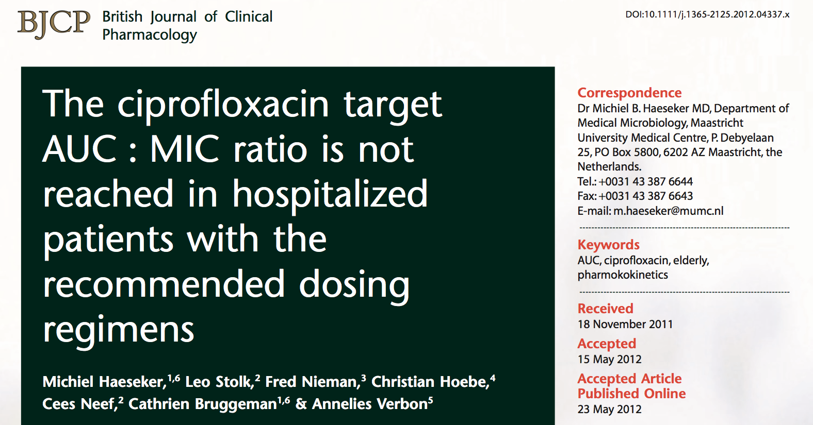

```{r echo=FALSE}
options(mrgsolve.soloc = "build")
knitr::opts_chunk$set(cache=TRUE,autodep=TRUE)
```


# Meropenem Population PK


<hr>

* Typical population PK model
* Simulate from EBE
* Visual predictive check
* Evaluate extended duration (3 hour) infusion compared to 0.5 hour
* Reference: src/ref/meropenem.pdf
* Model: model/meropenem_pk.cpp (and model/meropenem.cpp)

# EPO TIW/QW IV/SC and PTS


<hr>

* Set up dosing regimens
* Evaluate probability of technical success for once weekly 40,000 IU dose
  administered SC and IV
* Reference: src/ref/epo.pdf
* Model: model/epo.cpp

# Palivizumab dose optimization


<hr>

* Monoclonal antibody for respiratory syncytial virus (RSV)
* "One big simulation"
* Compare regimen in the label with other candidates to reduce total administered
  dose
* Reference: src/ref/palivizumab-sim.pdf
* Model: model/palivizumab.cpp

# Palivizumab PK modeling


<hr>

* Reference: src/ref/palivizumab-model.pdf

# OATP drug-drug interaction


<hr>

* Sensitivity analysis using PBPK model
* Parameter optimization
* Reference: src/ref/oatp-ddi.pdf
* Model: model/yoshikado.cpp
* Model: model/csa.cpp


# Fc-OPG for Osteoporosis


<hr>

* Basic population PK/PD model (indirect response)
* Obtain median change from baseline 2-weeks after single dose
  with 95% CI interval
* Reference: src/ref/opg.pdf
* Model: model/opg.cpp

# Ciprofloxaxin PBPK



<hr>

* Looking at ciprofloxacin exposure under different regimens in patients
  with and without renal dysfunction
* Use a PBPK model to simulate data presented in an independent publication
* Reference: src/ref/cipro-pk.pdf

# Ciprofloxacin PBPK


- Model: modeo/cipro.cpp

# Rifampicin PBPK


<hr>

* Demonstrate auto-induction of rifampin clearance
* Explore DDI between rifampin and midazolam 
* Reference: src/ref/rifampin.pdf
* Model: model/rifampicin.cpp
* Model: model/rifampicin_midazolam.cpp

# ERK Inhibition in Colorectal cancer


<hr>

* Evaluate combination dosing regimens using QSP model and a virtual 
  population
* Tumor dynamics under treatment with 1-4 different drugs
* Reference: src/ref/erk-inhibition.pdf
* Model: model/mapk.cpp

